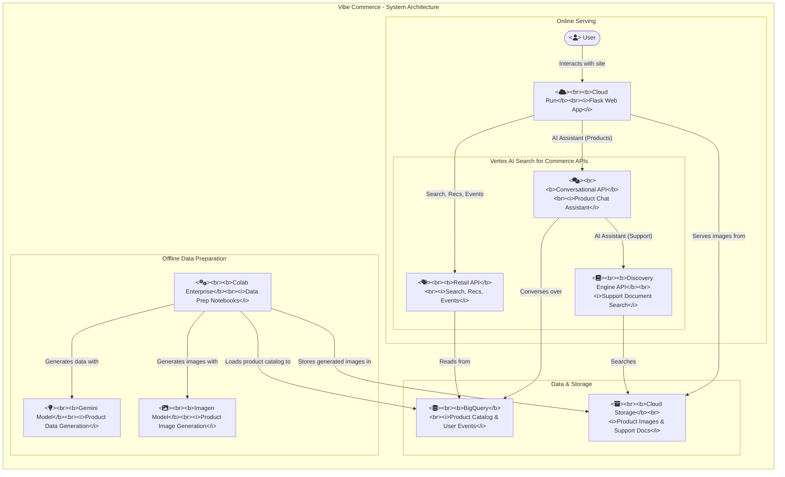

# Vibe Commerce - Vertex AI Search for Commerce Demo

Vibe Commerce is a sample e-commerce web application built with Flask and Python. It serves as a comprehensive demonstration of Google Cloud's [Vertex AI Search for Commerce](https://cloud.google.com/vertex-ai-search-for-retail) capabilities, showcasing how to integrate AI-powered search, recommendations, and conversational features into a modern retail experience.

## Features

This application demonstrates a wide range of features available in Vertex AI Search for Commerce:

-   **Keyword Search**: Fast and relevant product search.
-   **Faceted Search**: Filter search results by attributes like brand, color, price, and rating.
-   **Query Expansion**: Automatically broadens search queries to improve recall.
-   **Autocomplete**: Provides search query suggestions as the user types.
-   **Recommendations**: Displays "Others You May Like" recommendations on the homepage.
-   **Conversational Commerce**: An AI Assistant that can:
    -   Understand natural language queries.
    -   Provide LLM-generated answers to product questions.
    -   Handle comparisons, product details, and intent refinement.
    -   Integrate with a separate Discovery Engine datastore for support-related queries.
    -   Offer follow-up questions to guide the user.
-   **User Authentication**: Secure login and session management using Google OAuth 2.0.
-   **Shopping Cart**: Full add-to-cart, view cart, and checkout functionality.
-   **Server-Side Event Tracking**: Robust and reliable tracking of user events (page views, search, add-to-cart, purchase) sent directly to the Retail API.

## Architecture



## Prerequisites

Before you begin, ensure you have the following:

-   A Google Cloud Project with billing enabled.
-   The `gcloud` command-line tool installed and configured.
-   Python 3.8 or higher.
-   The following Google Cloud APIs enabled in your project:
    -   Retail API (`retail.googleapis.com`)
    -   Discovery Engine API (`discoveryengine.googleapis.com`)
-   A **Vertex AI Search for Commerce catalog** with product data ingested.
-   A **Discovery Engine datastore** (optional, for the support feature) with your support documents (e.g., FAQs) indexed.
-   An **OAuth 2.0 Client ID and Secret**. You can create this in the "APIs & Services" > "Credentials" section of the Google Cloud Console. Ensure you add an authorized redirect URI pointing to `/callback` on your deployed application (e.g., `https://<your-app-url>/callback` for Cloud Run and `http://127.0.0.1:5000/callback` for local testing).

## Local Development

### 1. Clone the Repository

```bash
git clone <repository-url>
cd vibe-commerce
```

### 2. Set Up Python Environment

It's recommended to use a virtual environment.

```bash
python3 -m venv venv
source venv/bin/activate
pip install -r requirements.txt
```

### 3. Configure Environment Variables

Create a `.env` file by copying the sample file.

```bash
cp sample.env .env
```

Now, edit the `.env` file and fill in the values for your specific Google Cloud project and configuration. See the Environment Variables section below for a detailed description of each variable.

### 4. Run the Application

You can run the application locally using the Flask development server.

```bash
flask run
```

The application will be available at `http://127.0.0.1:5000`.

## Deployment to Cloud Run

The included `deploy.sh` script simplifies deployment to Google Cloud Run.

### 1. Authenticate with gcloud

Ensure you are authenticated and have set your project.

```bash
gcloud auth login
gcloud config set project YOUR_PROJECT_ID
```

### 2. Run the Deployment Script

The script will read the variables from your `.env` file, build a container image from the source, and deploy it as a new Cloud Run service named `vibe-commerce`.

```bash
./deploy.sh
```

The script will output the URL of the deployed service upon completion.

## Environment Variables

The following environment variables are required to configure the application. These should be placed in a `.env` file in the project root.

| Variable                          | Required | Description                                                                                             |
| --------------------------------- | :------: | ------------------------------------------------------------------------------------------------------- |
| `PROJECT_ID`                      |   Yes    | Your Google Cloud project ID.                                                                           |
| `REGION`                          |   Yes    | The Google Cloud region where the Cloud Run service will be deployed (e.g., `us-central1`).             |
| `LOCATION`                        |   Yes    | The location of your Vertex AI Search catalog (e.g., `global` or `us`).                                 |
| `CATALOG_ID`                      |   Yes    | The ID of your product catalog in Vertex AI Search.                                                     |
| `SERVING_CONFIG_ID`               |   Yes    | The ID of the serving configuration used for standard product search.                                   |
| `RECOMMENDATION_SERVING_CONFIG_ID`|   Yes    | The ID of the serving configuration used for homepage recommendations.                                  |
| `GOOGLE_CLIENT_ID`                |   Yes    | The Client ID for your Google OAuth 2.0 application.                                                    |
| `GOOGLE_CLIENT_SECRET`            |   Yes    | The Client Secret for your Google OAuth 2.0 application.                                                |
| `SECRET_KEY`                      |   Yes    | A long, random string used to securely sign the session cookie.                                         |
| `SUPPORT_ENGINE_ID`               |   Yes    | The ID of the Discovery Engine datastore used for support queries.                                      |
| `SITE_NAME`                       |    No    | The name of the website, displayed in the UI. Defaults to "Vibe Commerce".                              |
| `SITE_LOGO_URL`                   |    No    | The path to the site logo image. Defaults to `/static/logo.png`.                                        |
| `SUPPORT_PROJECT_ID`              |    No    | The project ID for the support datastore. Defaults to the main `PROJECT_ID`.                            |
| `SUPPORT_LOCATION`                |    No    | The location of the support datastore. Defaults to `global`.                                            |
| `SUPPORT_COLLECTION_ID`           |    No    | The collection ID for the support datastore. Defaults to `default_collection`.                          |
| `SUPPORT_SERVING_CONFIG_ID`       |    No    | The serving config ID for the support datastore. Defaults to `default_search`.                          |